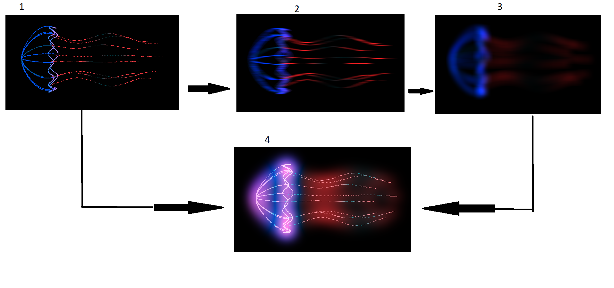

# TDT4230 Final Project: Bioluminescent jellyfish using bloom and HDR
Author: *Kasper Midttun Søreide*


## Project Overview
In this project I wanted to implement cool-looking glowing jellyfish, something like in this video: [1]. I wanted to acheive a cool glow effect that have a blurred halo. I googled arond a bit and found a great article describing bloom, a method that make bright regions glow. I ended up doing a simplified version of this, because I got improved visual results by blooming everything and not just the brightest colors. The jellyfish model is code generated and rendered using points. 


## The jellyfish model
The first step in this project was getting a basic jellyfish model. It was recommended to me to use an emission texture with a gradient along the jellyfish, but as I looked into it, I decided to go for something different. I don't have much experience with 3d modeling. I ended up creating the model from scratch using code and simplified the renedering to points and not triangles. I wanted the jellyfish to be transparent anyway. The top of the jellyfish is built as "bands" in a circle going down a half-sphere. The edge of the head is made by a sine wave going around the z-axis. The arms are just straight lines of dots around a circle slightly smaller than the radius of the head. Every vertex has 2 attributes: position and color.


## Animation
The animation for the jellyfish is done in the vertex shader. To get the smooth undulation motion of a jellyfish I found a sine wave to be a very good approximation. Because the model is built so that the z axis goes through the middle of the jellyfish's head, it was simple to get an animation that was radially symmetric around the z axis. The z-coordinate of the vertex is static, and the x and y-coordinates are multiplied by a sine wave with a phase offset proportional to the z-coordinate. The light animation is also performed in the vertex shader and uses the same sine wave method as for the position. This creates a nice pulsating light that traverses down the jellyfish. I also considered adding another attribute to decide how much the vertex should glow, but decided to keep it simple because it already looked good. This could be a fun idea to experiment with in the future. Here is a code snippet from the jellyfish vertex shader showing how the colors and positions are animated:
```
vertexColor = color + vec3(
  cosRange(7 * t + 3 * pos.z, -1.0, 1.0),
  0.0,
  0.0  
);
gl_Position = MVP * vec4(
  pos.x * sinRange(3 * t + 3 * pos.z, 0.7, 1.0), 
  pos.y * sinRange(3 * t + 3 * pos.z, 0.7, 1.0),
  pos.z,
  1.0
);
```

## Rendering pipeline
The whole rendering pipeline is very similar to the one found here: [2]. Figure 1 shows how the rendering pipeline is set up. 
<br>


<p style="text-align: center;"> <i> Figure 1: The rendering pipeline. The steps are performed in the order of the numbers in the image</i></p>
<br>
<br>
The program has 3 different framebuffers. All of them are set up to store floating-point numbers to enable HDR, meaning the value passed from the fragment shader can be greater than 1. The jellyfish is first rendered to the HDR framebuffer. Then this framebuffer is copied into one of two ping pong framebuffers used for gaussian blur. They are called ping pong buffers because they render into eachother back and forth. The blurring is done in two steps because of a trick that vastly improves performance. The blurring step is a convolution with a gaussian kernel. But, since gaussian is a separable function, it can be done first horizontally, and then vertically. So if we for example have a 5x5 kernel, instead of reading 25 pixels in a single pass, the two passes read 5 + 5 = 10 pixels instead. This improvement is very important for larger kernels. I ended up using a 32x32 kernel, so I don't think my computer could handle blurring in a single pass. Figure 2 shows how a 2 step gaussian blur is done.


<p style="text-align: center;"> <i>Figure 2: Gaussian blur is done in 2 passes, first horizontally and then vertically</i></p>
<br>
Steps 2 and 3 in figure 1 can be done multiple times to increase the radius of the blurring. In the end, the screen shader takes the original image from the HDR framebuffer and the blurred result and adds them together. This result is then remapped to get the resulting pixel in the range from 0 to 1. The screen shader uses functionality from [2]. Exposure and gamma can be tuned to get the best results. 


## Main challenges
The biggest challenge was getting the framebuffers to work. When working with framebuffers, the whole screen turns black when something is wrong. This of course makes it very difficult to debug. It was hard to know which shader broke and why, because runtime errors are not printed to the console, only compile time errors. The biggest help here was figuring out the best way to copy a texture into another. I googled around and looked at different forums, and the conclusion was that rendering a texture into a framebuffer is the most efficient way. I wrote a very simple shader that renders a texture to a rectangle that covers the screen. When I got it working, I used it to debug the other framebuffers and shaders. This was accomplished by copying a texture to the main framebuffer. This enabled me to look at every intermediate result and narrow down where the bugs were. 

Another hurdle was getting the geometry and animations right. It was hard to generate the geometry from scratch with only math. But it was a good exercise and allowed me to have full control over every vertex and I didn't have to use a 3D model editor. Small things like getting the displacement of the edge of the head to align with the rest of the head took some tweaking. I think I could have spent an eternity adding more details and tweaking the animations to be smoother and more natural, but I spent most of the time fixing the blurring effect. Further work I would like to do is add some randomness to the geometry, making each arm slightly different lengths, and making the edge of the head a little more chaotic. I would also make the light animations go through different hues over time and add a third "light color" attribute to each vertex and play around with different lights. 

## Limitations
The main limitation of this method is the blur radius. If I want to increase the radius I have to increase the kernel size and this reduces performance. The article from LearnOpenGL did link to another article describing a method to get increased performance for bigger kernels [3]. This idea could be explored more in the future. Another limitation in this implementation is that it is not possible to disable glow on anything. This means that if I want to draw a background first and then a jellyfish on top, the background would be blurry. A solution would be to separate bright and dark colors as in the LearnOpenGL bloom article [2]. Another disadvantage to my rendering method is that the 3D effect is a little limited as the object is fully transparent. If the jellyfish was rendered with proper triangles and texturing, I could have added transparency to the model and make the inside of the jellyfish slightly darker. But in my implementation this is not doable. But I think it still looks good as it is, and would probably look more 3D if it was placed in a scene with other objects.
## References

[1]: The secret superpowers of jellyfish, Quartz. url: https://www.youtube.com/watch?v=-irjnOIjNcs (retrieved 13.04.2023) <br>
[2]: Bloom, LearnOpenGL. url: https://learnopengl.com/Advanced-Lighting/Bloom (retrieved 13.04.2023) <br>
[3]: How To Do Good Bloom For HDR Rendering, Charilaos Kalogirou. url: https://kalogirou.net/2006/05/20/how-to-do-good-bloom-for-hdr-rendering/ (retrieved 15.04.2023) <br>
